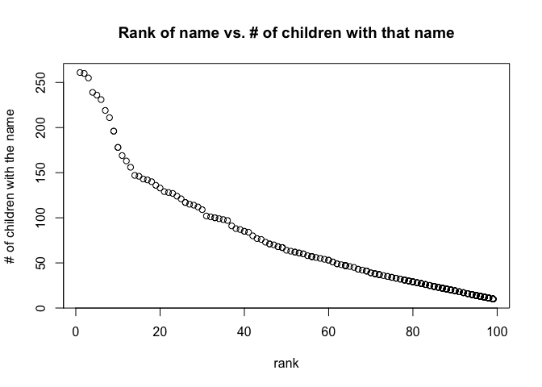

p8105\_hw2\_fl2569
================
Fang Liu
10/7/2021

## Problem 1

#### Mr. Trash Wheel Data

Specify the sheet in the Excel file and omit non-data entries using
arguments in `read_excel`.

-   Use reasonable variable names
-   Omit rows that do not include dumpster-specific data
-   Round the number of sports balls to the nearest integer

``` r
library(tidyverse)
library(readxl)
options(tibble.print_min = 5)
```

``` r
trash_wheel_df = 
  read_excel("./data/Trash-Wheel-Collection-Totals-7-2020-2.xlsx", 
                          sheet = "Mr. Trash Wheel", 
                          range = cell_cols("A:N")) %>% 
  janitor::clean_names() %>% 
  drop_na(dumpster) %>%
  mutate(sports_balls = round(sports_balls, digits = 0))

trash_wheel_df
```

    ## # A tibble: 454 x 14
    ##   dumpster month  year date                weight_tons volume_cubic_yards
    ##   <chr>    <chr> <dbl> <dttm>                    <dbl>              <dbl>
    ## 1 1        May    2014 2014-05-16 00:00:00        4.31                 18
    ## 2 2        May    2014 2014-05-16 00:00:00        2.74                 13
    ## 3 3        May    2014 2014-05-16 00:00:00        3.45                 15
    ## 4 4        May    2014 2014-05-17 00:00:00        3.1                  15
    ## 5 5        May    2014 2014-05-17 00:00:00        4.06                 18
    ## # … with 449 more rows, and 8 more variables: plastic_bottles <dbl>,
    ## #   polystyrene <dbl>, cigarette_butts <dbl>, glass_bottles <dbl>,
    ## #   grocery_bags <dbl>, chip_bags <dbl>, sports_balls <dbl>,
    ## #   homes_powered <dbl>

#### Clean and combine precipitation data

Read and clean the precipitation data for 2018 and 2019:

-   Omit rows without precipitation data
-   Add a variable for year

``` r
#2018 data
precip_2018 =
  read_excel("./data/Trash-Wheel-Collection-Totals-7-2020-2.xlsx",
                          sheet = "2018 Precipitation", 
                          skip = 1) %>% 
  janitor::clean_names() %>% 
  mutate(year = 2018) %>% 
  drop_na() 

#2019 data
precip_2019 =
  read_excel("./data/Trash-Wheel-Collection-Totals-7-2020-2.xlsx",
                          sheet = "2019 Precipitation", 
                          skip = 1) %>%
  janitor::clean_names() %>% 
  mutate(year = 2019) %>% 
  drop_na()
```

Combine precipitation data sets and convert month (from numeric) to a
character variable.

``` r
precip_combined =
  bind_rows(precip_2018, precip_2019) %>% 
  mutate(month = month.name[month])

precip_combined
```

    ## # A tibble: 24 x 3
    ##   month    total  year
    ##   <chr>    <dbl> <dbl>
    ## 1 January   0.94  2018
    ## 2 February  4.8   2018
    ## 3 March     2.69  2018
    ## 4 April     4.69  2018
    ## 5 May       9.27  2018
    ## # … with 19 more rows

#### Describe the data

The *Mr. Trash Wheel* data has **454** rows and **14** columns. The
variables are **dumpster, month, year, date, weight\_tons,
volume\_cubic\_yards, plastic\_bottles, polystyrene, cigarette\_butts,
glass\_bottles, grocery\_bags, chip\_bags, sports\_balls,
homes\_powered**. The dataset tells us the volume and weight of trash
collected by a certain dumpster on a given day and also include details
on the type and quantify of trash collected, such as the number of
plastic bottles and sports balls. The median number of sports balls in a
dumpster in 2019, for example, is **9**.

The combined precipitation data for 2018 and 2019 has **24** rows and
**3** columns(i.e., month, total, year). The total precipitation in 2018
is **70.33** inches.

## Problem 2

The goal of this problem is to merge the data in `pols-month.csv`,
`unemployment.csv`, and `snp.csv` into a single data frame, using
**year** and **month** as keys across data sets.

#### First, clean the data in `pols-month.csv`:

-   Use separate( ) to break up the variable `mon` into integer
    variables year, month, day
-   Replace month number with month name
-   Create a president variable taking values gop and dem
-   Remove prez\_dem, prez\_gop, day variable

``` r
pols_df =
  read_csv("./data/fivethirtyeight_datasets/pols-month.csv") %>% 
  separate(mon, c('year', 'month', 'day'), sep = "-", convert = TRUE) %>%
  mutate(month = str_to_lower(month.abb[month])) %>% 
  mutate(president = ifelse(prez_dem == 1, "dem", "gop")) %>% 
  select(-prez_dem, -prez_gop, -day)

pols_df
```

    ## # A tibble: 822 x 9
    ##    year month gov_gop sen_gop rep_gop gov_dem sen_dem rep_dem president
    ##   <int> <chr>   <dbl>   <dbl>   <dbl>   <dbl>   <dbl>   <dbl> <chr>    
    ## 1  1947 jan        23      51     253      23      45     198 dem      
    ## 2  1947 feb        23      51     253      23      45     198 dem      
    ## 3  1947 mar        23      51     253      23      45     198 dem      
    ## 4  1947 apr        23      51     253      23      45     198 dem      
    ## 5  1947 may        23      51     253      23      45     198 dem      
    ## # … with 817 more rows

#### Second, clean the data in `snp.csv`:

Arrange according to year and month, and organize so that year and month
are the leading columns.

``` r
stock_df =
  read_csv("./data/fivethirtyeight_datasets/snp.csv") %>% 
  separate(date, c('month', 'day', 'year'), sep = "/", convert = TRUE) %>%
  mutate(
    year = ifelse(year <= 15, year + 2000, year + 1900), 
    month = str_to_lower(month.abb[month])) %>% 
  arrange(year, month) %>%
  select(year, month, close)

stock_df
```

    ## # A tibble: 787 x 3
    ##    year month close
    ##   <dbl> <chr> <dbl>
    ## 1  1950 apr    18.0
    ## 2  1950 aug    18.4
    ## 3  1950 dec    20.4
    ## 4  1950 feb    17.2
    ## 5  1950 jan    17.0
    ## # … with 782 more rows

#### Third, tidy the unemployment data:

-   Switch from “wide” to “long” format - make sure the key variables
    have same name

``` r
unemploy_df =
  read_csv("./data/fivethirtyeight_datasets/unemployment.csv") %>% 
  janitor::clean_names() %>%
  pivot_longer(
    jan:dec,
    names_to = "month",
    values_to = "unemploy"
  )

unemploy_df
```

    ## # A tibble: 816 x 3
    ##    year month unemploy
    ##   <dbl> <chr>    <dbl>
    ## 1  1948 jan        3.4
    ## 2  1948 feb        3.8
    ## 3  1948 mar        4  
    ## 4  1948 apr        3.9
    ## 5  1948 may        3.5
    ## # … with 811 more rows

#### Join the datasets

Merge snp into pols, and unemployment into the result.

``` r
#Merge stock data into politician data
snp_and_pol =
  left_join(pols_df, stock_df, by = c("year", "month"))

#Merge unemployment data into results
final_join_data =
  left_join(snp_and_pol, unemploy_df, by = c("year", "month"))
```

#### Describe the datasets

Explain briefly what each dataset contained, and describe the resulting
dataset (e.g. give the dimension, range of years, and names of key
variables).

The `pols_df` dataset has **822** rows and **9** columns. It gives us
the \# of national politicians who are democratic or republican at any
given time (i.e., the \# of republican/democratic governors, senators,
representatives) and also whether the president is a republican or
democratic.

The `stock_df` dataset has **787** rows and **3** columns. This dataset
gives the closing values of the S&P stock index on a cetain date and is
used a representative measure of the stock market.

The `unemploy_df` dataset has **816** rows and **3** columns and gives
the percentage of unemployment in a certain month of a year. The average
unemployment rate in 1948 is 3.75%. The average unemployment rate in
2008 is 5.8%.

The combined dataset (with politician data, stock market, and
unemployment data) has **822** rows and **11** columns (i.e., year,
month, gov\_gop, sen\_gop, rep\_gop, gov\_dem, sen\_dem, rep\_dem,
president, close, unemploy). The data contains information from year
**1947** to year **2015**.

## Problem 3

Load and tidy the data. Note: the names of a categorical predictor and
the case structure of string variables changes over time; some rows are
duplicated and need to be removed.

``` r
baby_names_df = 
  read_csv("./data/Popular_Baby_Names.csv", col_types = 'icccii') %>% 
  janitor::clean_names() %>% 
  mutate(
    gender = tolower(gender),
    ethnicity = tolower(ethnicity),
    ethnicity = case_when(
      ethnicity %in% c("asian and paci", "asian and pacific islander") ~ "asian and pacific islander",
      ethnicity %in% c("black non hispanic", "black non hisp") ~ "black non hispanic",
      ethnicity %in% c("white non hispanic", "white non hisp") ~ "white non hispanic",
      TRUE ~ "hispanic"),
    childs_first_name = tolower(childs_first_name)) %>% 
  distinct()

baby_names_df
```

    ## # A tibble: 12,181 x 6
    ##   year_of_birth gender ethnicity                  childs_first_name count  rank
    ##           <int> <chr>  <chr>                      <chr>             <int> <int>
    ## 1          2016 female asian and pacific islander olivia              172     1
    ## 2          2016 female asian and pacific islander chloe               112     2
    ## 3          2016 female asian and pacific islander sophia              104     3
    ## 4          2016 female asian and pacific islander emily                99     4
    ## 5          2016 female asian and pacific islander emma                 99     4
    ## # … with 12,176 more rows

#### Produce a well-structured, reader-friendly table showing:

-   The rank in popularity of the name “Olivia” as a female baby name
    over time
-   Rows for ethnicity and columns for year

``` r
olivia_rank =
  baby_names_df %>% 
  filter(childs_first_name == 'olivia', gender == 'female') %>% 
  select(year_of_birth, ethnicity, rank) %>%
  arrange(by_group = year_of_birth)

olivia_table = 
  pivot_wider(olivia_rank,
              names_from = year_of_birth,
              values_from = rank)
olivia_table
```

    ## # A tibble: 4 x 7
    ##   ethnicity                  `2011` `2012` `2013` `2014` `2015` `2016`
    ##   <chr>                       <int>  <int>  <int>  <int>  <int>  <int>
    ## 1 asian and pacific islander      4      3      3      1      1      1
    ## 2 black non hispanic             10      8      6      8      4      8
    ## 3 hispanic                       18     22     22     16     16     13
    ## 4 white non hispanic              2      4      1      1      1      1

#### Produce a similar table showing the most popular name among male children over time

``` r
male_popularity =
  baby_names_df %>%
  filter(gender == "male", rank == 1) %>%
  select(year_of_birth, ethnicity, childs_first_name) %>% 
  arrange(by_group = year_of_birth)

male_table = 
  pivot_wider(male_popularity,
              names_from = year_of_birth,
              values_from = childs_first_name)
male_table
```

    ## # A tibble: 4 x 7
    ##   ethnicity                  `2011`  `2012` `2013` `2014` `2015` `2016`
    ##   <chr>                      <chr>   <chr>  <chr>  <chr>  <chr>  <chr> 
    ## 1 asian and pacific islander ethan   ryan   jayden jayden jayden ethan 
    ## 2 black non hispanic         jayden  jayden ethan  ethan  noah   noah  
    ## 3 hispanic                   jayden  jayden jayden liam   liam   liam  
    ## 4 white non hispanic         michael joseph david  joseph david  joseph

#### Produce a scatter plot

-   For male, white non-Hispanic children born in 2016
-   Show the \# of children with a name (y axis) against the rank in
    popularity of that name (x axis)

``` r
scatter_data =
  baby_names_df %>% 
  filter(year_of_birth == 2016, 
         gender == "male", 
         ethnicity == 'white non hispanic') %>% 
  arrange(rank)

plot(pull(scatter_data, rank), pull(scatter_data, count),
     xlab = 'rank', 
     ylab = '# of children with the name', 
     main = 'Rank of name vs. # of children with that name')
```

<!-- -->
